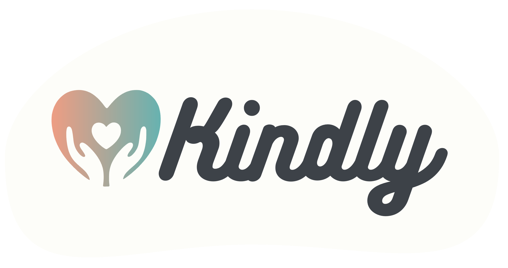

# Kindly – Community Help Platform

*A modern, human-centered way to connect people who need help with volunteers who care.*

Kindly is a full-stack web application that bridges the gap between help seekers—often elderly individuals—and local volunteers. By combining intuitive design, geo-location features, task management, and a trust-based review system, Kindly makes community assistance simple, transparent, and accessible.

Developed for the **Software Architectures** course (2025).

## 📄 Project Documentation

For the detailed descriptions, see the attached **[Hungarian Documentation](docs/documentation-hu.pdf)**.
